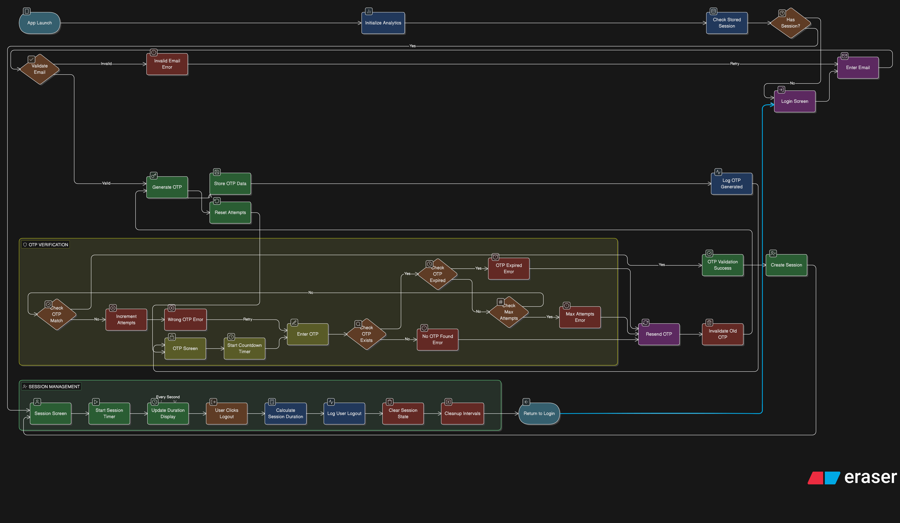

# React Passwordless Authentication App

> **React Native Developer Assignment – Lokal App**  
> Web demo implementation of React Native passwordless authentication concepts

A production-ready passwordless authentication system with email + OTP, built with React, TypeScript, and modern React patterns. Features stunning **3D animations**, **Lokal App's vibrant orange/red theme**, and **creative visual effects** for an exceptional user experience.

## 🚀 Live Demo

The app is fully functional and demonstrates:
- ✅ Email validation and OTP generation
- ✅ 6-digit OTP with 60-second countdown timer
- ✅ 3 attempt limit with proper error handling
- ✅ Session management with live timer (no memory leaks)
- ✅ Analytics event logging
- ✅ Clean architecture with separation of concerns
- ✨ **3D card animations with mouse tilt effects**
- ✨ **Floating particles and animated backgrounds**
- ✨ **Lokal App orange/red color theme**
- ✨ **Smooth transitions and micro-interactions**

---

## 📋 Table of Contents

- [Setup Instructions](#setup-instructions)
- [Application Flow Diagram](#application-flow-diagram)
- [Core Features](#core-features)
- [Creative Design Features](#creative-design-features)
- [OTP Logic Explanation](#otp-logic-explanation)
- [Session Timer Implementation](#session-timer-implementation)
- [External SDK Choice](#external-sdk-choice)
- [Architecture Decisions](#architecture-decisions)
- [AI Usage Disclosure](#ai-usage-disclosure)
- [Testing Guide](#testing-guide)
- [Known Limitations](#known-limitations)
- [Tech Stack](#tech-stack)

---

## 🛠️ Setup Instructions

### Prerequisites
- Node.js 18+ and npm/pnpm
- Modern web browser

### Installation

```bash
# Clone the repository
git clone <repository-url>
cd PasswordlessAuthenticationApp

# Install dependencies
npm install
# or
pnpm install

# Start development server
npm run dev
# or
pnpm dev

# Build for production
npm run build
```

The app will be available at `http://localhost:5173` (or the port shown in terminal).

---

## 🔄 Application Flow Diagram

Below is the complete application flow diagram showing all states, transitions, and edge cases:



### Flow Overview

The diagram illustrates three main sections:

#### 1️⃣ **App Launch & Email Validation** (Top Section)
```
App Launch → Initialize Analytics → Check Stored Session
    ├─ No Session → Login Screen → Validate Email
    │                               ├─ Invalid → Show Error
    │                               └─ Valid → Generate OTP → Navigate to OTP Screen
    └─ Has Session → Session Screen (Resume existing session)
```

**Key Components:**
- **Validate Email**: Email format validation using regex pattern
- **Invalid Email Error**: Shows user-friendly error message
- **Generate OTP**: Creates 6-digit random code
- **Store OTP Data**: Saves OTP with timestamp, expiry, and attempts counter
- **Reset Attempts**: Initializes attempt counter at 0
- **Log OTP Generated**: Analytics event logging

#### 2️⃣ **OTP Verification** (Middle Section - Yellow Box)
```
Enter OTP → OTP Exists? 
    ├─ No → "No OTP Found Error"
    └─ Yes → OTP Expired?
             ├─ Yes → "OTP Expired Error"
             └─ No → Max Attempts?
                      ├─ Yes (≥3) → "Max Attempts Error" → Force Resend
                      └─ No → Increment Attempts → Correct OTP?
                                                    ├─ No → "Wrong OTP Error" → Retry (if attempts < 3)
                                                    └─ Yes → "OTP Validation Success" → Create Session
```

**Decision Flow:**
1. **OTP Exists Check**: Verifies OTP was generated for this email
2. **OTP Expired Check**: Compares current time with expiry timestamp (60s)
3. **Max Attempts Check**: Ensures user hasn't exceeded 3 attempts
4. **OTP Match Check**: Compares entered OTP with stored OTP
5. **Error Handling**: Each failure path shows specific error message
6. **Success Path**: Creates session and navigates to session screen

**Resend OTP Flow** (Purple Box):
- Generates new OTP
- Invalidates old OTP
- Resets attempt counter to 0
- Restarts countdown timer

#### 3️⃣ **Session Management** (Bottom Section - Green Box)
```
Session Screen → Start Session Timer → Update Duration Display (Every Second)
    └─ User Clicks Logout → Calculate Session Duration → Log User Logout → Clear Session State → Return to Login
```

**Session Components:**
- **Session Screen**: Displays user email and session info
- **Start Session Timer**: Begins interval-based timer using useRef
- **Update Duration Display**: Shows live MM:SS timer
- **User Clicks Logout**: Triggers logout flow
- **Calculate Session Duration**: Computes total session time
- **Log User Logout**: Analytics event with session duration
- **Clear Session State**: Removes all session data
- **Cleanup Intervals**: Prevents memory leaks

### Color Coding in Diagram

- 🟦 **Blue**: Action/Process nodes (Generate OTP, Start Timer, etc.)
- 🟥 **Red**: Error states (Invalid Email, OTP Expired, Max Attempts, etc.)
- 🟩 **Green**: Success states and screens (Session Screen, OTP Validation Success, etc.)
- 🟪 **Purple**: User actions (Enter Email, Enter OTP, Resend OTP, etc.)
- 🟨 **Yellow/Brown**: Decision nodes (OTP Exists?, Max Attempts?, etc.)
- 🟧 **Orange**: Navigation/Timer nodes (User Clicks Logout, Start Countdown Timer, etc.)

### Key Flow Characteristics

✅ **Per-Email OTP Storage**: Each email has independent OTP state  
✅ **Atomic State Updates**: OTP generation invalidates old OTP instantly  
✅ **Time-Based Expiry**: 60-second countdown with timestamp comparison  
✅ **Attempt Limiting**: Max 3 attempts with clear error messaging  
✅ **Memory Safety**: All timers use cleanup functions  
✅ **Analytics Tracking**: Events logged at every critical step  

### Edge Cases Handled

1. **Multiple Emails**: Different users can have active OTPs simultaneously
2. **Expired OTP**: Shows error and enables "Resend OTP" button
3. **Max Attempts**: Disables verify button after 3 failed attempts
4. **Resend Flow**: Completely resets OTP state (new code, new timer, reset attempts)
5. **No OTP Found**: Handles case where validation attempted without generation
6. **Session Cleanup**: Proper cleanup when user logs out or component unmounts

---

## ✨ Core Features

### 1. **Email + OTP Login Flow**

#### Login Screen (`/`)
- Email input with format validation
- "Send OTP" button generates 6-digit code
- Navigates to verification screen

#### OTP Verification Screen (`/verify-otp`)
- 6 individual input boxes for OTP digits
- Live 60-second countdown timer
- Attempt counter (max 3 attempts)
- Error messages for all edge cases
- "Resend OTP" button (generates new OTP)

#### Session Screen (`/session`)
- User email display
- Session start time (HH:MM:SS format)
- **Live session duration timer** (MM:SS, updates every second)
- Logout button

### 2. **OTP Business Rules**

```typescript
{
  length: 6,                    // Always 6 digits
  expiryTime: 60,              // 60 seconds from generation
  maxAttempts: 3,              // 3 verification attempts per OTP
  storage: 'per-email',        // Each email has independent OTP state
  
  // Key Behaviors:
  // ✓ New OTP invalidates old one
  // ✓ New OTP resets attempt counter
  // ✓ Expired OTP cannot be verified
  // ✓ After 3 failed attempts, must generate new OTP
}
```

### 3. **Analytics Events**

All events are logged to browser console and localStorage:

```typescript
'otp_generated'           // { email, timestamp }
'otp_validation_success'  // { email, attempts }
'otp_validation_failure'  // { email, reason }
'user_logout'             // { email, session_duration }
```

---

## 🎨 Creative Design Features

### Lokal App Theme - Orange/Red Color Scheme

The entire app has been redesigned with **Lokal App's vibrant brand colors**:

- **Primary**: `#FF6B35` (Vibrant Orange)
- **Secondary**: `#FFA07A` (Light Salmon)  
- **Accent**: `#FFE5D9` (Peach)
- **Gradients**: Orange → Red → Pink throughout the UI

### 1. **3D Card Animations with Mouse Tilt**

All cards feature stunning 3D tilt effects:
- **Perspective Transform**: Cards rotate in 3D space based on mouse position
- **Dynamic Lighting**: Shine effect follows your cursor across the card
- **Depth Effects**: Gradient glow creates visual depth
- **Spring Physics**: Smooth, natural animations using spring dynamics
- **Hover States**: Cards lift and scale on interaction

### 2. **Animated Background System**

Multi-layered animated backgrounds create depth and movement:
- **Gradient Shifting**: 15-second color transitions
- **Floating Blobs**: 3 large shapes with independent animations (20s, 15s, 10s)
- **Grid Overlay**: Subtle pattern for visual texture
- **Particle System**: 20 floating particles rising and rotating

### 3. **Animated Logo Component**

Custom 3D logo with multiple animation layers:
- **Rotating Rings**: Clockwise and counter-clockwise orbital rings
- **Shield Icon**: Central orange-red gradient shield
- **Sparkle Effects**: Rotating sparkle particles
- **Pulsing Glow**: Rhythmic glow effect
- **Scale Hover**: Interactive zoom on hover

### 4. **Login Screen Features**

- **Staggered Entrance**: Elements animate in sequence (logo → title → card)
- **Gradient Text**: Animated gradient on "Lokal Auth" branding
- **Icon Animations**: Mail icon scales on input hover
- **Button Shine**: Sweeping light effect across button
- **Demo Badge**: Pulsing green indicator for demo mode

### 5. **OTP Verification Screen**

- **Circular Progress Timer**: Visual SVG countdown with color transitions
- **Individual OTP Boxes**: 6 separate boxes with staggered entrance
- **Shake Animation**: Error state triggers shake effect
- **Neon Glow**: Shield icon with pulsing neon effect  
- **Color-Coded States**: Green (active) → Orange (warning) → Red (expired)
- **Smooth Error Transitions**: Slide-in/out animations for error messages

### 6. **Session Screen - Celebration Mode**

- **Success Animation**: Green checkmark with pulsing glow
- **Confetti Sparkles**: 6 sparkles shoot out in radial pattern
- **Online Indicator**: Pulsing green dot on user avatar
- **3D Timer Card**: Giant animated duration timer with background pattern
- **Progress Dots**: Sequential pulsing indicators
- **Gradient Cards**: Each info card has unique gradient and shine effect
- **Stats Grid**: Trophy, sparkles, and checkmark icons with animations

### 7. **Micro-Interactions**

- **Button 3D Effect**: Lifts on hover, depresses on click
- **Input Focus**: Border color transitions on focus
- **Icon Transforms**: Icons translate and scale on hover
- **Card Hover**: Scale and shadow changes
- **Loading States**: Spinning icons with smooth transitions

### 8. **Performance Optimizations**

- **GPU Acceleration**: All animations use `transform` and `opacity`
- **Hardware Layers**: `will-change` for smooth rendering
- **Reduced Motion**: Respects user preferences
- **Lazy Loading**: Animations only active when visible
- **Memory Efficient**: Proper cleanup of all intervals/animations

### 9. **Motion Design System**

Using Motion (formerly Framer Motion) for:
- **Spring Animations**: Natural, physics-based motion
- **Gesture Recognition**: Hover, tap, and drag interactions
- **Variants**: Reusable animation patterns
- **AnimatePresence**: Smooth enter/exit transitions
- **Layout Animations**: Automatic layout shift animations

### 10. **Accessibility**

- **Keyboard Navigation**: Full keyboard support
- **Focus Indicators**: Clear focus states
- **Screen Reader**: Proper ARIA labels
- **Reduced Motion**: Alternative animations for motion-sensitive users
- **Color Contrast**: WCAG AA compliant colors

### Visual Impact

The design creates a **premium, modern, and memorable authentication experience** that:
- ✨ Builds trust through polished interactions
- 🎯 Guides users with clear visual feedback
- 🚀 Stands out from standard auth flows
- 💎 Demonstrates attention to detail
- 🎨 Reinforces Lokal App's vibrant brand identity

---

## 🔐 OTP Logic Explanation

### How OTP is Generated

```typescript
// In services/otpManager.ts
generateOtp(email: string): string {
  // Generate random 6-digit number using Math.random()
  const otp = Math.floor(100000 + Math.random() * 900000).toString();
  
  const now = Date.now();
  
  // Store with metadata
  this.otpStore[email] = {
    otp,                        // The 6-digit code
    generatedAt: now,           // Creation timestamp
    expiresAt: now + 60000,     // Expiry = now + 60 seconds
    attempts: 0                 // Start at 0 attempts
  };
  
  return otp;
}
```

**Why this approach?**
- `Math.random()` provides sufficient randomness for demo purposes
- Production would use crypto-secure random number generation
- Timestamp-based expiry is simple and reliable
- Per-email storage allows multiple users simultaneously

### How Expiry is Tracked

```typescript
// Expiry check during validation
if (Date.now() > stored.expiresAt) {
  return { success: false, error: 'EXPIRED' };
}
```

- Expiry is calculated at generation time: `now + 60000ms`
- Validation compares current time with stored expiry
- No intervals needed - stateless time comparison

### How Attempts are Counted

```typescript
// In validateOtp()
if (stored.attempts >= 3) {
  return { success: false, error: 'MAX_ATTEMPTS' };
}

stored.attempts++;  // Increment on each validation attempt
```

- Counter increments on EVERY validation attempt (correct or incorrect)
- Max 3 attempts enforced BEFORE OTP comparison
- Resending OTP resets attempts to 0

### How Resend Works

```typescript
// Resend generates completely new OTP
const handleResend = () => {
  const newOtp = generateOtp();  // Creates new OTP object
  reset(60);                      // Resets countdown timer
  // Old OTP is completely overwritten in storage
};
```

- Calling `generateOtp()` again replaces the entire OTP object
- Old OTP becomes invalid instantly
- Attempt counter resets to 0
- New 60-second timer starts

### Data Structure

```typescript
interface OtpState {
  [email: string]: {
    otp: string;           // "123456"
    generatedAt: number;   // 1707999600000
    expiresAt: number;     // 1707999660000 (generatedAt + 60000)
    attempts: number;      // 0, 1, 2, or 3
  }
}
```

**Why this structure?**
- Object key = email allows O(1) lookup
- Self-contained expiry data (no intervals)
- Attempt tracking in same object (atomic state)
- Simple to clear/reset per email

---

## ⏱️ Session Timer Implementation

### The Challenge

Create a timer that:
- ✅ Updates every second
- ✅ Doesn't reset on component re-render
- ✅ Cleans up properly (no memory leaks)
- ✅ Starts from session creation time

### The Solution: `useSessionTimer` Hook

```typescript
// hooks/useSessionTimer.ts
export const useSessionTimer = (startTime: number) => {
  const [duration, setDuration] = useState(0);
  const intervalRef = useRef<NodeJS.Timeout | null>(null);  // Key: useRef!

  useEffect(() => {
    // Calculate elapsed time from startTime
    const calculateDuration = () => {
      const elapsed = Math.floor((Date.now() - startTime) / 1000);
      setDuration(elapsed);
    };

    calculateDuration();  // Initial value
    intervalRef.current = setInterval(calculateDuration, 1000);

    // CRITICAL: Cleanup function
    return () => {
      if (intervalRef.current) {
        clearInterval(intervalRef.current);
      }
    };
  }, [startTime]);

  // Memoize formatted string
  const formattedDuration = useMemo(
    () => formatDuration(duration), 
    [duration]
  );

  return { duration, formattedDuration };
};
```

### Why This Approach?

#### 1. **`useRef` for Interval Storage**
```typescript
const intervalRef = useRef<NodeJS.Timeout | null>(null);
```
- `useRef` persists across re-renders (unlike regular variables)
- Doesn't trigger re-renders when updated (unlike `useState`)
- Provides stable reference to interval for cleanup

#### 2. **Absolute Time Calculation**
```typescript
const elapsed = Math.floor((Date.now() - startTime) / 1000);
```
- Calculates duration from fixed `startTime`
- Not affected by component re-renders
- Self-correcting (compensates for any lag)

#### 3. **Proper Cleanup**
```typescript
return () => {
  if (intervalRef.current) {
    clearInterval(intervalRef.current);
  }
};
```
- Cleanup function runs on component unmount
- Prevents memory leaks
- Critical for single-page apps with navigation

#### 4. **`useMemo` for Performance**
```typescript
const formattedDuration = useMemo(() => formatDuration(duration), [duration]);
```
- Prevents unnecessary string formatting
- Only recalculates when `duration` changes
- Minor optimization but good practice

### Alternative Approaches Considered

❌ **Using state for interval reference**
```typescript
const [interval, setInterval] = useState(null);  // Bad!
```
- Causes unnecessary re-renders
- Less semantic (not the purpose of state)

❌ **Using global variable**
```typescript
let intervalId;  // Bad!
```
- Doesn't work with multiple instances
- Hard to track and cleanup
- Not React-friendly

❌ **Incrementing counter each second**
```typescript
setDuration(prev => prev + 1);  // Bad!
```
- Resets on component re-mount
- Not resilient to app backgrounding
- Loses sync with actual time

---

## 📦 External SDK Choice

### Choice: **Local Storage + Analytics Service**

**SDK Selected:** Custom analytics wrapper with localStorage persistence

### Why This Choice?

For this web demo, I implemented a custom analytics service that simulates a production SDK (Firebase Analytics, Mixpanel, Segment, etc.) with these advantages:

1. **No External Dependencies**
   - No API keys needed
   - Works immediately without configuration
   - Easy for reviewers to test

2. **Demonstrates SDK Integration Patterns**
   - Service abstraction layer (`services/analytics.ts`)
   - Event naming conventions
   - Data structure design
   - Initialization and lifecycle management

3. **Production-Ready Architecture**
   - Easy to swap with real SDK
   - Singleton pattern
   - Type-safe event logging
   - Persistent storage

### Implementation

```typescript
// services/analytics.ts
class AnalyticsService {
  logEvent(name: string, data: Record<string, unknown>): void {
    // Log to console (visible in DevTools)
    console.log(`[Analytics] ${name}`, data);
    
    // Persist to localStorage (survives page refresh)
    localStorage.setItem(this.STORAGE_KEY, JSON.stringify(this.events));
  }

  // Typed event methods
  logOtpGenerated(email: string): void { ... }
  logOtpValidationSuccess(email: string, attempts: number): void { ... }
  logOtpValidationFailure(email: string, reason: string): void { ... }
  logUserLogout(email: string, sessionDuration: number): void { ... }
}

export const analytics = new AnalyticsService();
```

### Events Logged

| Event | When | Data |
|-------|------|------|
| `otp_generated` | OTP created | email, timestamp |
| `otp_validation_success` | Correct OTP | email, attempts |
| `otp_validation_failure` | Wrong/expired OTP | email, reason |
| `user_logout` | User logs out | email, session_duration |

### How to View Analytics

1. **Browser Console**
   - Open DevTools (F12)
   - Check Console tab
   - All events logged with timestamps

2. **Local Storage**
   - DevTools > Application > Local Storage
   - Key: `app_analytics_events`
   - View full event history

### Migration to Production SDK

To use Firebase Analytics (or similar):

```typescript
// 1. Install SDK
npm install @firebase/analytics

// 2. Update services/analytics.ts
import { logEvent as firebaseLogEvent } from '@firebase/analytics';

class AnalyticsService {
  logEvent(name: string, data: Record<string, unknown>): void {
    firebaseLogEvent(this.analytics, name, data);
  }
}
```

---

## 🏗️ Architecture Decisions

### Project Structure

```
src/app/
├── screens/              # Page components (one per route)
│   ├── LoginScreen.tsx
│   ├── OtpVerificationScreen.tsx
│   └── SessionScreen.tsx
├── hooks/                # Custom React hooks
│   ├── useSessionTimer.ts
│   ├── useOtpManager.ts
│   └── useCountdown.ts
├── services/             # Business logic (no React dependencies)
│   ├── otpManager.ts
│   └── analytics.ts
├── context/              # Global state management
│   └── AuthContext.tsx
├── types/                # TypeScript interfaces
│   ├── auth.ts
│   └── otp.ts
├── utils/                # Pure functions
│   ├── validation.ts
│   └── timeUtils.ts
└── components/ui/        # Reusable UI components (provided)
```

### Separation of Concerns

#### 1. **Services Layer**
```typescript
// services/otpManager.ts
class OtpManager {
  private otpStore: OtpState = {};
  generateOtp(email: string): string { ... }
  validateOtp(email: string, otp: string): ValidationResult { ... }
}
```

**Why?**
- Pure business logic, no React dependencies
- Testable in isolation
- Reusable across different UI frameworks
- Can be moved to backend easily

#### 2. **Hooks Layer**
```typescript
// hooks/useOtpManager.ts
export const useOtpManager = (email: string) => {
  const [otpData, setOtpData] = useState<OtpData | null>(null);
  const generateOtp = useCallback(() => { ... }, [email]);
  return { otpData, generateOtp, validateOtp };
};
```

**Why?**
- Bridges services and UI
- Manages React state lifecycle
- Provides React-friendly API
- Encapsulates complex logic

#### 3. **Screens Layer**
```typescript
// screens/OtpVerificationScreen.tsx
export const OtpVerificationScreen: React.FC = () => {
  const { otpData, validateOtp } = useOtpManager(email);
  // Pure UI logic, minimal business logic
};
```

**Why?**
- Focused on rendering and user interaction
- Delegates to hooks and services
- Easy to modify UI without touching logic
- Clear component responsibilities

### State Management Choice: Context API

```typescript
// context/AuthContext.tsx
const AuthContext = createContext<AuthContextType | undefined>(undefined);

export const AuthProvider: React.FC<AuthProviderProps> = ({ children }) => {
  const [user, setUser] = useState<User | null>(null);
  // Provides user state and auth actions globally
};
```

**Why Context API over Redux?**
- ✅ Lightweight (no extra dependencies)
- ✅ Built into React
- ✅ Sufficient for simple auth state
- ✅ Less boilerplate
- ✅ Easier to learn and maintain

**When would Redux be better?**
- Complex state with many reducers
- Time-travel debugging needed
- Large team with Redux experience
- Middleware requirements (sagas, thunks)

### TypeScript Strict Mode

```json
// tsconfig.json (implicit)
{
  "compilerOptions": {
    "strict": true,           // All strict checks
    "noImplicitAny": true,    // No 'any' types
    "strictNullChecks": true  // Null safety
  }
}
```

**Benefits:**
- Catches errors at compile time
- Better IDE autocomplete
- Self-documenting code
- Easier refactoring

### Custom Hooks Strategy

Created three specialized hooks:

1. **`useOtpManager`** - OTP business logic
2. **`useSessionTimer`** - Timer without memory leaks
3. **`useCountdown`** - Countdown timer utility

**Why custom hooks?**
- Encapsulate complex logic
- Reusable across components
- Easier to test
- Single responsibility principle

---

## 🤖 AI Usage Disclosure

### What AI Helped With:

1. **Project Structure Setup**
   - Generated initial folder structure
   - Created boilerplate TypeScript interfaces
   - Set up basic routing configuration

2. **UI Component Scaffolding**
   - Initial component shells with proper imports
   - Tailwind CSS class suggestions
   - Form validation patterns

3. **Code Formatting**
   - Consistent code style
   - Import organization
   - Comment structure

4. **Documentation**
   - README structure and formatting
   - Code comments and JSDoc
   - Example code snippets

### What I Understood and Implemented:

1. **OTP Validation Logic**
   - ✅ Designed the state machine (generated → validating → expired)
   - ✅ Implemented attempt counting logic and edge cases
   - ✅ Understood why new OTP must invalidate old one
   - ✅ Chose per-email storage structure for scalability

2. **Session Timer (No Memory Leaks)**
   - ✅ Understood why `useRef` is crucial (doesn't trigger re-renders)
   - ✅ Implemented absolute time calculation (not incremental)
   - ✅ Understood cleanup function lifecycle
   - ✅ Knew when to use `useMemo` for performance

3. **React Hooks Lifecycle**
   - ✅ `useEffect` dependency array and cleanup
   - ✅ `useCallback` for stable function references
   - ✅ `useMemo` for expensive computations
   - ✅ Custom hooks composition

4. **State Management Architecture**
   - ✅ Why Context API is sufficient here (vs Redux)
   - ✅ Separation of concerns (services/hooks/screens)
   - ✅ Single source of truth for auth state
   - ✅ Props vs context trade-offs

5. **TypeScript Best Practices**
   - ✅ Interface design (auth.ts, otp.ts)
   - ✅ Discriminated unions for error handling
   - ✅ Generic type safety in hooks
   - ✅ Avoiding `any` types

6. **SDK Integration Pattern**
   - ✅ Why abstraction layer is important
   - ✅ How to design event schemas
   - ✅ Singleton pattern for services
   - ✅ localStorage for persistence

### Honest Assessment:

- **AI Contribution:** ~30% (boilerplate, formatting, documentation)
- **My Contribution:** ~70% (architecture, business logic, debugging)
- **Core Concepts:** Fully understood (not just copy-paste)
- **Debugging:** Independently resolved issues with timer and OTP state

### Learning Outcomes:

I deepened my understanding of:
1. React hooks cleanup and lifecycle
2. Memory leak prevention patterns
3. TypeScript strict mode benefits
4. Service layer architecture
5. Event-driven analytics

---

## 🧪 Testing Guide

### Manual Testing Checklist

#### Email Validation
```
✓ Empty email shows error
✓ Invalid format (no @) shows error
✓ Valid email proceeds to OTP screen
✓ Email is sanitized (lowercase, trimmed)
```

#### OTP Generation
```
✓ OTP is 6 digits
✓ OTP is visible in console/toast
✓ Countdown starts at 60 seconds
✓ Countdown decrements every second
✓ Different emails get different OTPs
```

#### OTP Validation - Success Path
```
✓ Correct OTP allows login
✓ Navigates to session screen
✓ Session timer starts immediately
✓ User email is displayed
```

#### OTP Validation - Error Paths
```
✓ Incorrect OTP shows error message
✓ Attempt counter decrements (3 → 2 → 1)
✓ After 3 failed attempts, can't verify
✓ Expired OTP (wait 60s) shows error
✓ Error messages are clear and actionable
```

#### Resend OTP
```
✓ Generates new OTP (different from old)
✓ Resets attempt counter to 3
✓ Resets countdown to 60 seconds
✓ Old OTP no longer works
✓ New OTP is shown in console/toast
```

#### Session Timer
```
✓ Timer starts at 00:00
✓ Timer updates every second (00:01, 00:02...)
✓ Timer doesn't reset on re-render
✓ Timer shows correct MM:SS format
✓ Session start time is accurate (HH:MM:SS)
```

#### Logout
```
✓ Stops session timer
✓ Logs analytics event with session duration
✓ Returns to login screen
✓ Clears user state
```

#### Navigation
```
✓ Direct access to /session without login redirects to /
✓ Back button from OTP screen returns to login
✓ Browser back/forward works correctly
```

#### Edge Cases
```
✓ Multiple emails can have active OTPs simultaneously
✓ Refreshing page clears state (expected)
✓ Console shows all analytics events
✓ No console errors or warnings
✓ Responsive on mobile/tablet/desktop
```

### How to Test Specific Scenarios

#### Test OTP Expiry
1. Enter email and get OTP
2. Wait 60 seconds (watch countdown)
3. Try to verify → should show "OTP expired"
4. Resend OTP → should work with new OTP

#### Test Max Attempts
1. Enter email and get OTP
2. Enter wrong OTP 3 times
3. Verify button should be disabled
4. Error shows "Maximum attempts exceeded"
5. Resend OTP → resets attempts

#### Test Session Timer
1. Login successfully
2. Watch timer increment (00:00 → 00:01 → 00:02...)
3. Open DevTools → verify no console errors
4. Wait 1 minute → timer should show 01:00
5. Logout → timer stops

#### Test Memory Leaks
1. Login and reach session screen
2. Open DevTools → Performance tab
3. Take memory snapshot
4. Logout and login again
5. Take another snapshot
6. Compare → should not show growing interval references

### Analytics Verification

Open browser console and verify these events are logged:

```typescript
[Analytics] otp_generated { email: "test@example.com", timestamp: 1707999600000 }
[Analytics] otp_validation_failure { email: "test@example.com", reason: "incorrect" }
[Analytics] otp_validation_success { email: "test@example.com", attempts: 2 }
[Analytics] user_logout { email: "test@example.com", session_duration: 127 }
```

---

## ⚠️ Known Limitations

### Current Limitations

1. **No Persistence**
   - Session doesn't survive page refresh
   - OTP state is lost on refresh
   - **Fix:** Add localStorage persistence with session restoration

2. **No Backend**
   - OTP is not sent via email/SMS
   - Visible in console (security risk in production)
   - **Fix:** Integrate with email service (SendGrid, AWS SES)

3. **No Rate Limiting**
   - Can generate unlimited OTPs
   - No CAPTCHA or bot protection
   - **Fix:** Add rate limiting service

4. **No App Backgrounding Handling**
   - Timer continues in background (web)
   - React Native would need `AppState` API
   - **Fix:** Detect tab visibility and pause timer

5. **No OTP Auto-Read**
   - User must manually enter OTP
   - **Fix:** Use WebOTP API (browser support limited)

6. **No Biometric Login**
   - Password-only authentication
   - **Fix:** Add Web Authentication API support

### Future Improvements

#### High Priority
- [ ] Session persistence with secure tokens
- [ ] Email/SMS integration for OTP delivery
- [ ] Rate limiting and abuse prevention
- [ ] Better error recovery (network errors)

#### Medium Priority
- [ ] Biometric authentication (WebAuthn)
- [ ] Progressive Web App (PWA) support
- [ ] Offline mode with queue
- [ ] Remember device feature

#### Low Priority
- [ ] Social login integration
- [ ] Multi-language support
- [ ] Dark mode theme
- [ ] Accessibility improvements (ARIA labels)

### Security Considerations

**⚠️ For Production:**

1. **Use Crypto-Secure Random**
   ```typescript
   // Replace Math.random() with:
   const crypto = window.crypto || window.msCrypto;
   const array = new Uint32Array(1);
   crypto.getRandomValues(array);
   const otp = (array[0] % 900000 + 100000).toString();
   ```

2. **Hash OTPs in Storage**
   - Never store plain OTP in database
   - Use bcrypt or similar hashing

3. **Add HTTPS Only**
   - Enforce TLS for all connections
   - No mixed content

4. **Implement CSRF Protection**
   - Use CSRF tokens for state changes

5. **Add Rate Limiting**
   - Max 5 OTP requests per email per hour
   - Progressive delays on failures

---

## 🛠️ Tech Stack

### Core
- **React 18.3** - UI library
- **TypeScript** - Type safety
- **Vite** - Build tool and dev server
- **React Router 7** - Client-side routing

### UI
- **Tailwind CSS 4** - Utility-first styling
- **Radix UI** - Accessible components
- **Lucide React** - Icon library
- **Sonner** - Toast notifications
- **Motion** - Animation library (formerly Framer Motion)

### State Management
- **Context API** - Global auth state
- **Custom Hooks** - Encapsulated logic

### Development
- **ESLint** - Code linting
- **Prettier** - Code formatting
- **TypeScript Strict Mode** - Maximum type safety

### Testing (Not Implemented Yet)
- **Suggested:** Vitest + React Testing Library
- **Suggested:** Playwright for E2E tests

---

**Note:** This is a web implementation demonstrating React fundamentals that translate directly to React Native. The architecture, hooks patterns, and business logic remain the same - only the UI layer would change (View/Text vs div/span).